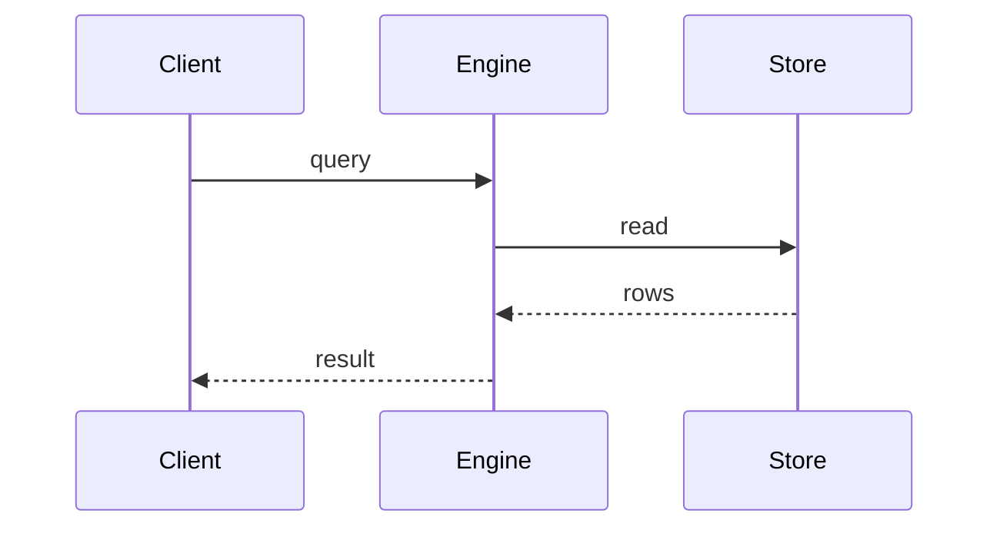

# Data

> Stub - expanded once the storage model settles.

How relational data and vectors are stored, indexed and queried, and how the
engine is distributed.

## Flow

```mermaid
sequenceDiagram
    participant Client
    participant Engine
    participant Store
    Client->>Engine: query
    Engine->>Store: read
    Store-->>Engine: rows
    Engine-->>Client: result
```
