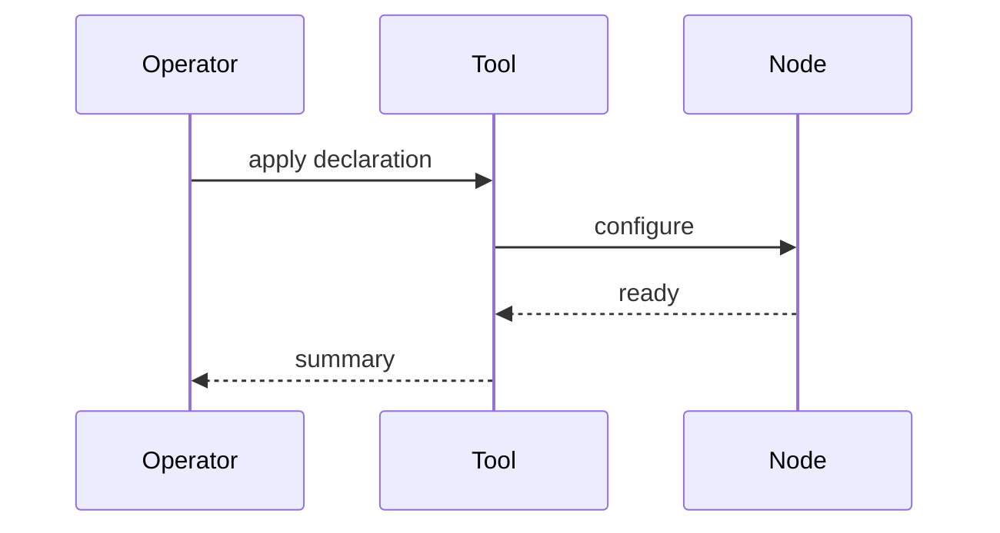

# Operations

> Stub - expanded once the operating model settles.

How hosts, clusters, datastores, backups and firewall rules are declared and
applied.

## Flow

```mermaid
sequenceDiagram
    participant Operator
    participant Tool
    participant Node
    Operator->>Tool: apply declaration
    Tool->>Node: configure
    Node-->>Tool: ready
    Tool-->>Operator: summary
```
