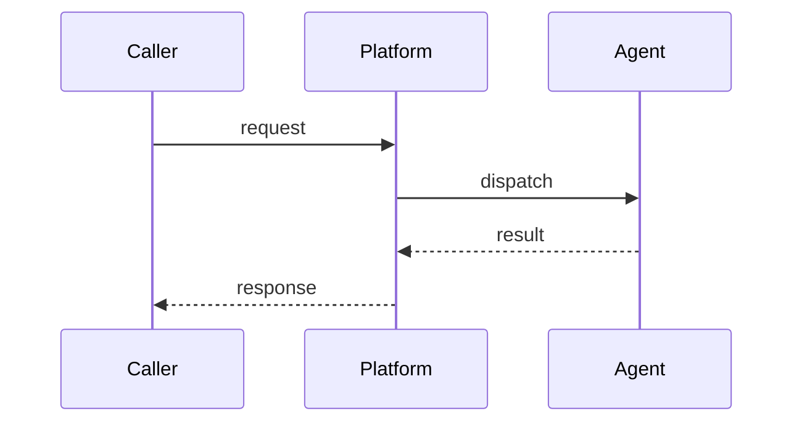

# Platform

> Stub: expanded once the platform definition settles.

How capabilities are exposed and called: agents, robots, toolsets, jobs,
scheduling and human confirmation.

## Flow

```mermaid
sequenceDiagram
    participant Caller
    participant Platform
    participant Agent
    Caller->>Platform: request
    Platform->>Agent: dispatch
    Agent-->>Platform: result
    Platform-->>Caller: response
```
