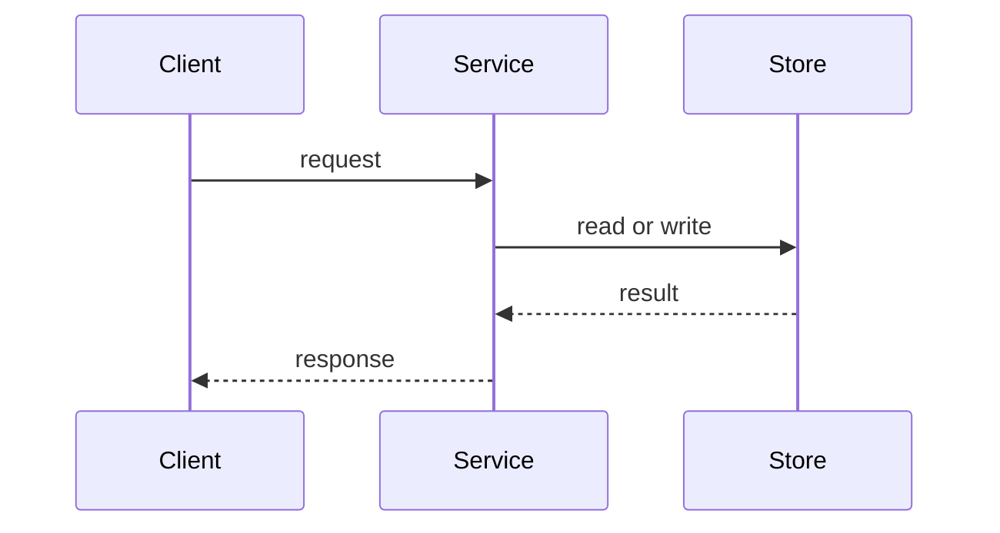

# Services

> Stub - expanded once the service contract settles.

How a service is declared: entries, authentication, storage, events,
documentation and deployment.

## Flow

```mermaid
sequenceDiagram
    participant Client
    participant Service
    participant Store
    Client->>Service: request
    Service->>Store: read or write
    Store-->>Service: result
    Service-->>Client: response
```
