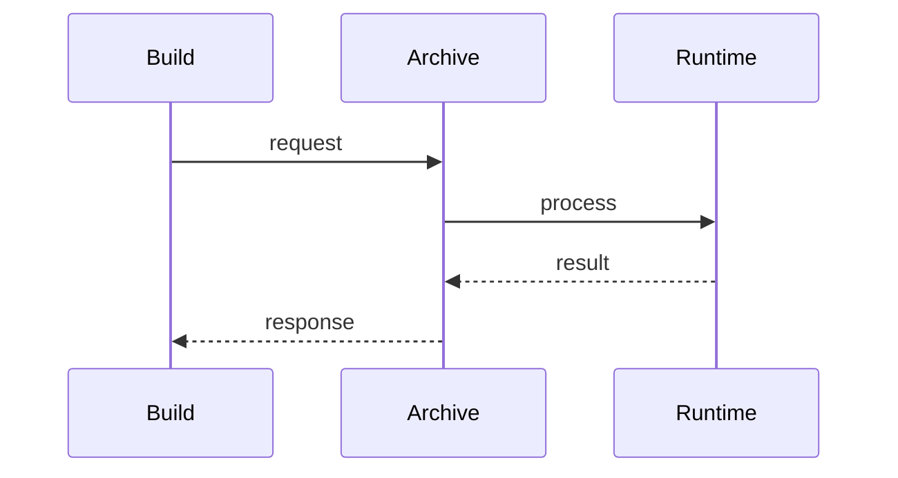

# Deployment

> Stub — expanded as the engine evolves.

## Distribution

- Per-version archives (Linux amd64, macOS arm64).
- Container image for server deployments.

## Notes

- Build it and run it as its own service.
- GPU acceleration is planned; CPU works today.

## Flow

