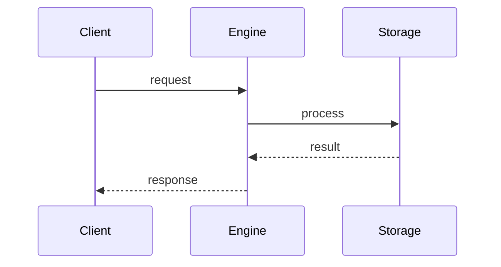

# Overview

> Stub — expanded as the engine evolves.

Neural DB is an SQL engine that also stores and searches **vectors**, so a single
service can answer both relational queries and semantic search.

## When to use it

- You need SQL plus vector search in one place.
- You want to avoid running a separate vector database.

## Notes

- It is a standalone program: you build and run it, you do not import it.

## Flow

