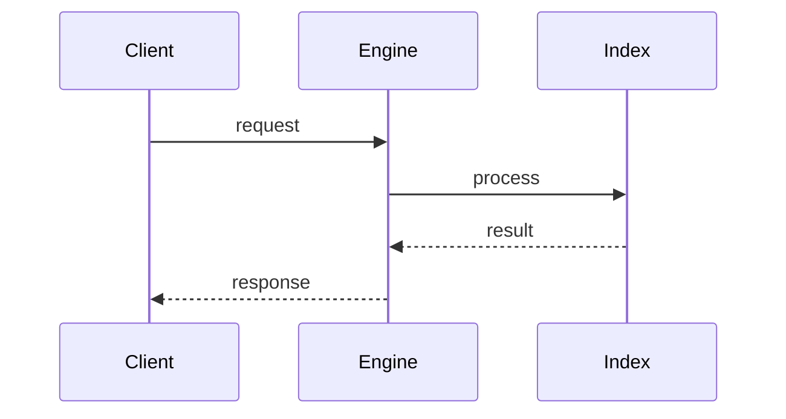

# Vector search

> Stub — expanded as the engine evolves.

## Concept

Embeddings are stored next to relational data and searched by similarity.

## Notes

- Indexing strategy affects recall and speed.
- Quantization trades a little accuracy for a lot of memory.

## Flow

