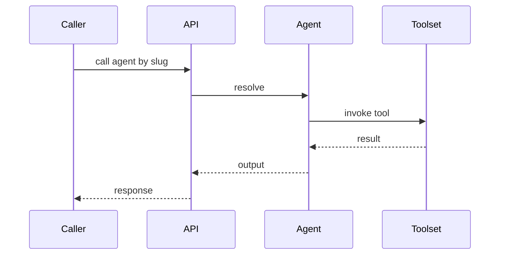

# Agent types

> Stub — expanded as the platform evolves.

## Categories

- **Agent** — consumes a toolset and performs tasks for the user.
- **Toolset** — a bundle of tools invoked together (code `XXX-P01`, e.g. `GEN-P01`).
- **Robot** — physical automation; identified by the area prefix (`XXX-R01`,
  e.g. `MED-R01`). A robot has no toolset of its own.

## How each is addressed

- Agents and robots are reached by their **slug**.
- Tools are reached by their **code**.

## Notes

- Robotics codes always use the area prefix — there is no `ROB-*` family.

## Flow

