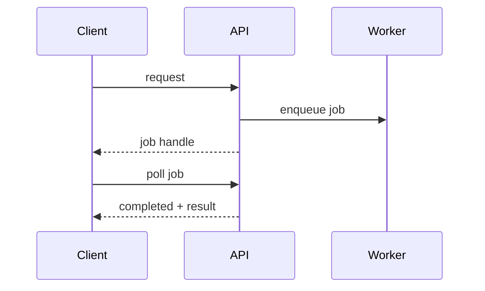

# API usage

> Stub — expanded as the platform evolves.

## Request flow

Every call returns either a result or a **job handle** for long operations.

- Short operation → result in the response.
- Long operation → poll the job until it completes.

## Errors

- Validation errors are returned with the offending field.
- A rejected operation reports the reason and whether a retry makes sense.

## Notes

- Retries must be idempotent.
- The same request repeated must not duplicate the effect.

## Flow

