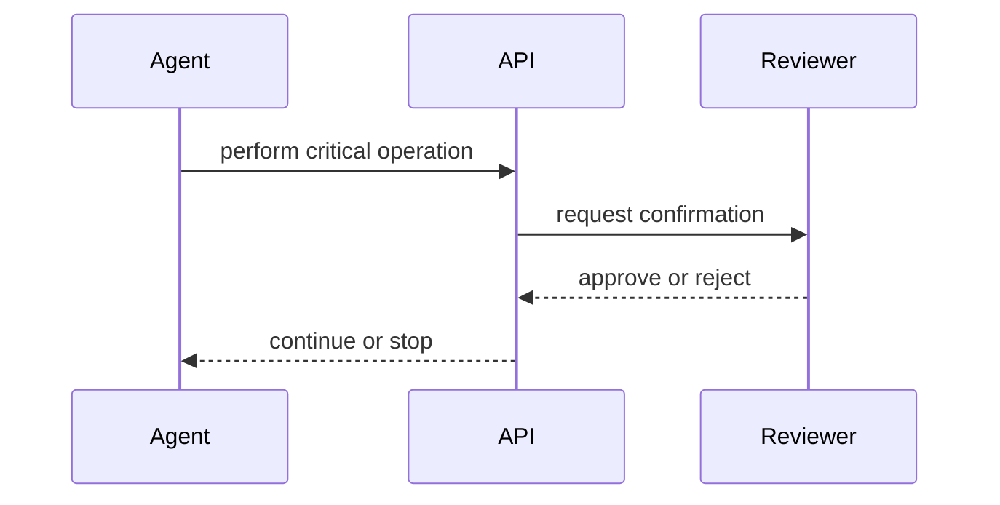

# Human-in-the-loop (HIL)

> Stub — expanded as the platform evolves.

## Rules

- HIL is triggered by the **operation type**, not by the caller.
- While pending, the operation waits for a human decision.
- A rejection stops the operation; an approval lets it continue.

## Notes

- Only critical operations enter HIL.
- The caller is notified of the outcome.

## Flow

