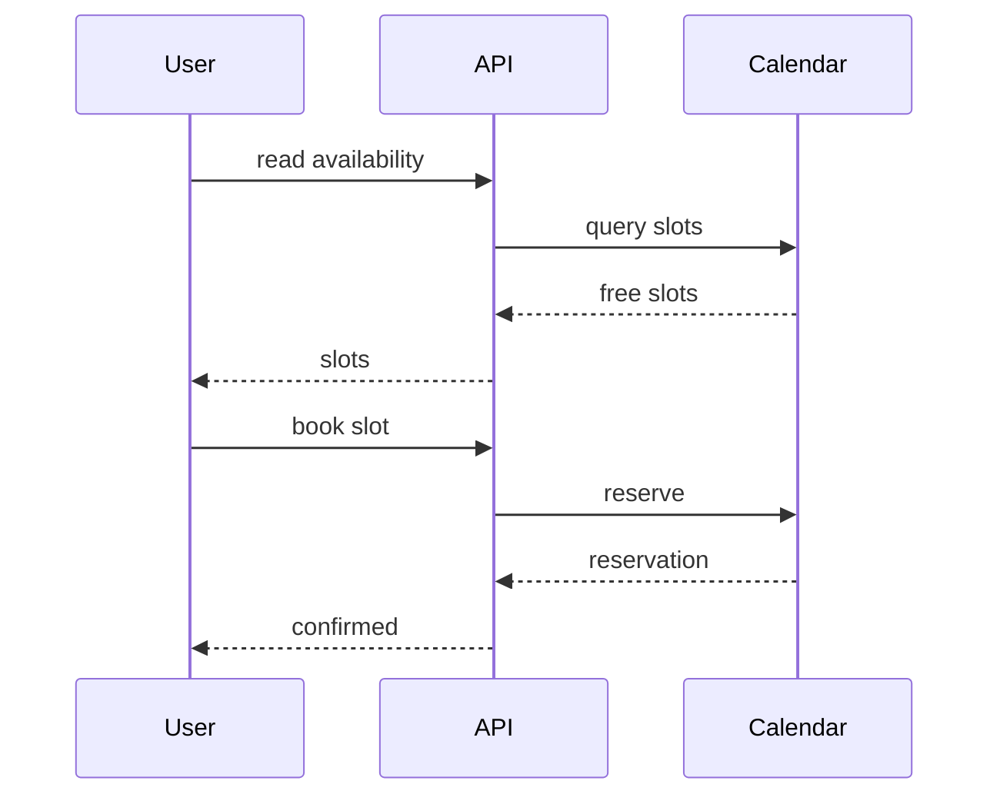

# Scheduling

> Stub — expanded as the platform evolves.

## Flow

1. Read the agent's availability window.
2. Book a slot — it becomes a reservation.
3. The reservation is confirmed and the agent runs at that time.

## Notes

- Availability is always read before booking.
- A slot cannot be double-booked.

## Flow

