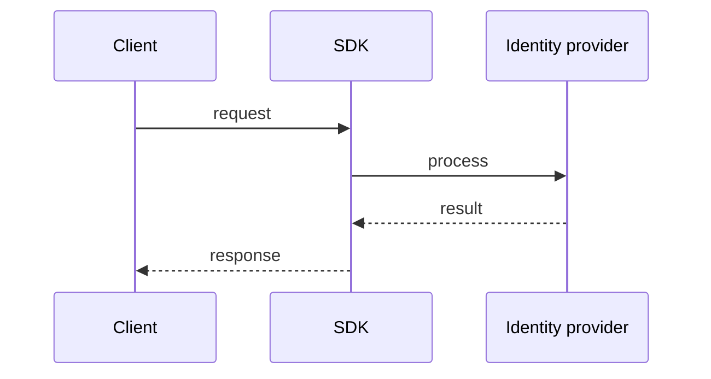

# Auth

> Stub — expanded as the SDK evolves.

## Modes

- `jwt` — validates tokens against a JWKS.
- `basic` — username/password.
- `oauth` — RFC 7662 token introspection.
- `session` — shared KV session with TTL.

Modes can be combined as alternatives. Roles apply to non-JWT modes as well.

## Notes

- Auth is declared per entry.
- Failing config fails fast at startup.

## Flow

