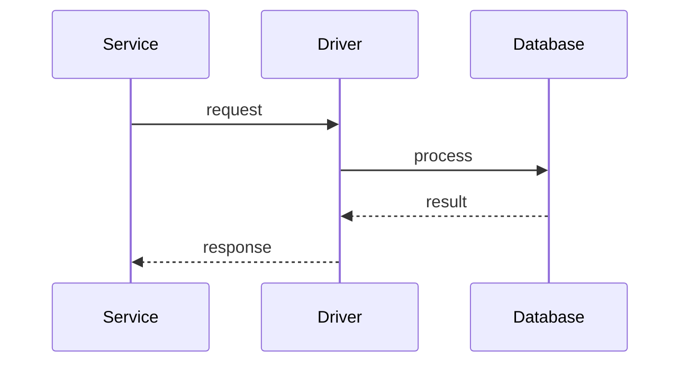

# Database

> Stub — expanded as the SDK evolves.

## Drivers

- SQLite / libSQL (default).
- Turso.
- PostgreSQL.
- MySQL / MariaDB.
- MongoDB.

## Notes

- Connection config is declared in YAML.
- Filters and sorting follow the driver semantics.
- Schema migrations are external for now.

## Flow

