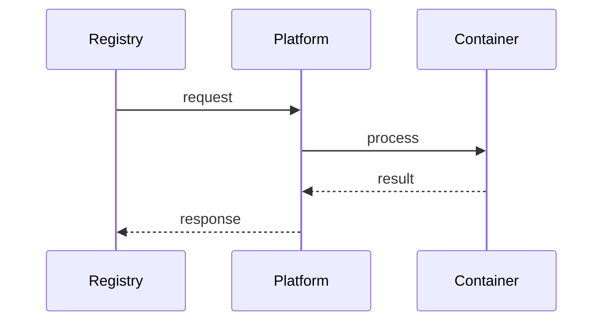

# Deployment

> Stub — expanded as the SDK evolves.

## Build

Multi-stage Docker image; the binary embeds the YAML renderer and templates.

## Health checks

`/startupz`, `/readyz`, `/livez` — already built into the runtime.

## Notes

- One binary per service.
- Configuration comes from environment variables and the YAML.

## Flow

