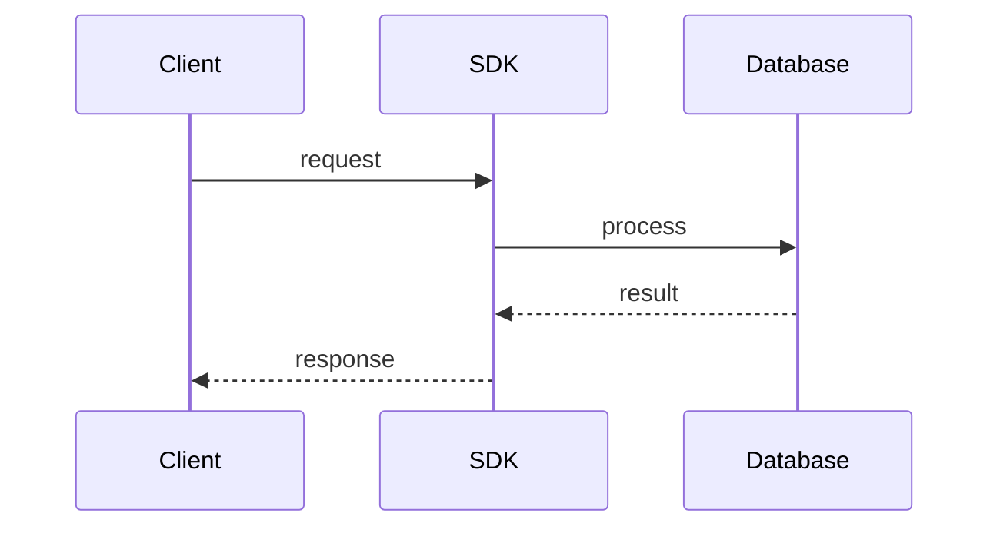

# Entries

> Stub — expanded as the SDK evolves.

Entries are declared in `service.yaml`. Each entry maps to routes, a model and
optional auth.

## Kinds

- **CRUD** — list, get, create, update, patch, delete.
- **REST** — explicit method + path.
- **webhook** — inbound handler.
- **file** — upload/download.
- **async** — long-running job with status polling.

## Notes

- `path:` can nest routes.
- Pagination and filtering follow the same semantics across CRUD and REST.

## Flow

