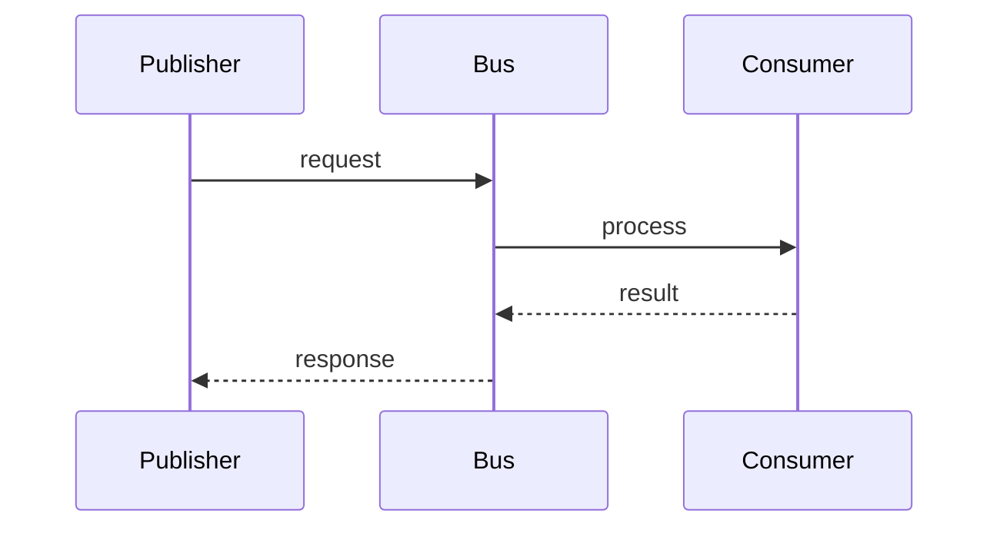

# Events

> Stub — expanded as the SDK evolves.

Events run over **NATS (JetStream)**.

## Auth options

- token
- nkey / seed
- credentials file

## Notes

- Publishing and consuming are declared, not hardcoded.
- Consumer idempotency is required (messages may repeat).

## Flow

