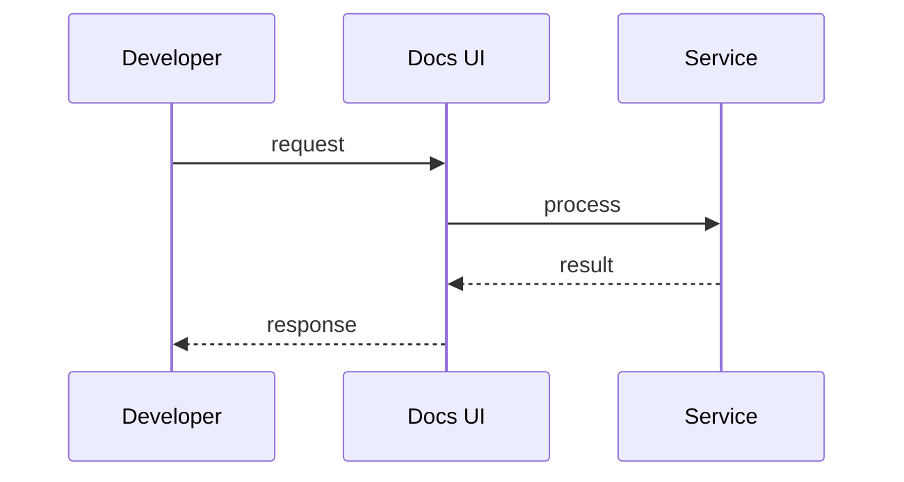

# OpenAPI

> Stub — expanded as the SDK evolves.

## Rules

- The spec is generated from `service.yaml`.
- Scalar renders the docs UI.
- `Cache-Control` and `ETag` are emitted on both gzip and non-gzip branches.

## Notes

- Hidden entries can be excluded from the public spec.
- Docs stay in sync with the entries automatically.

## Flow

