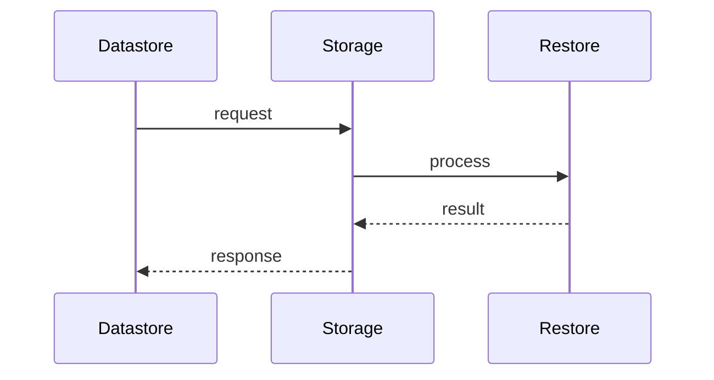

# Backups

> Stub — expanded as the CLI evolves.

## Rules

- Backups go to an S3-compatible bucket.
- Each service uses its own prefix.
- Before re-deploying, stale prefixes must be cleared to avoid a broken bootstrap.

## Restore

- PostgreSQL: point-in-time recovery to a target time.
- Redis-compatible: snapshot restore.
- NATS: sealed stream restore.

## Notes

- Credentials are configured per host, never committed.

## Flow

