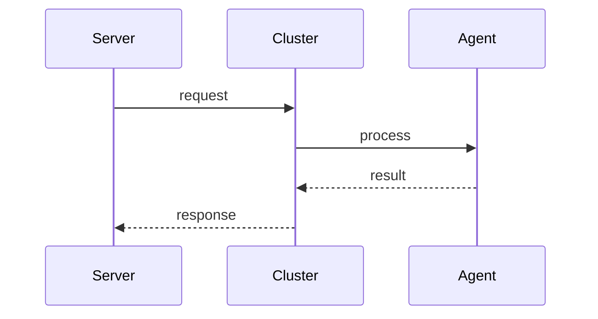

# Clusters

> Stub — expanded as the CLI evolves.

## k3s

- Roles: `server` and `agent`.
- HA: several servers joined to the same cluster.
- Traefik can be enabled or disabled per YAML.

## Notes

- The cluster keeps its own embedded datastore; external etcd is only for
  services that need a distributed lock.

## Flow

