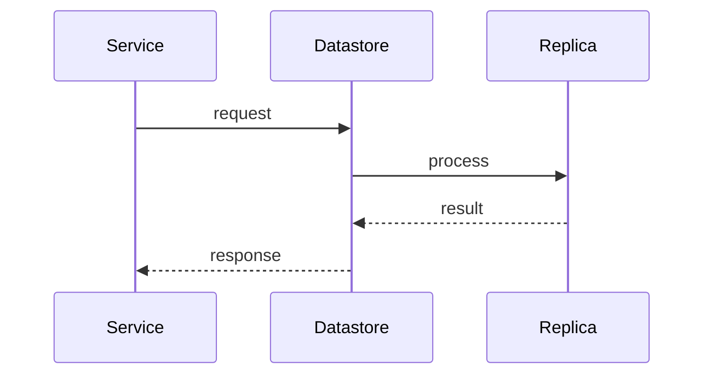

# Datastores

> Stub — expanded as the CLI evolves.

Supported services, each in bare-metal, dockerized and cluster variants:

- **PostgreSQL** — operator-based, with point-in-time recovery.
- **Redis-compatible** — with streaming replication and failover.
- **NATS** — JetStream, with token/nkey/creds auth.
- **etcd** — for distributed coordination.

## Notes

- Each service ships validation, test and diagnostics commands.
- Backups go to object storage (S3 API).

## Flow

