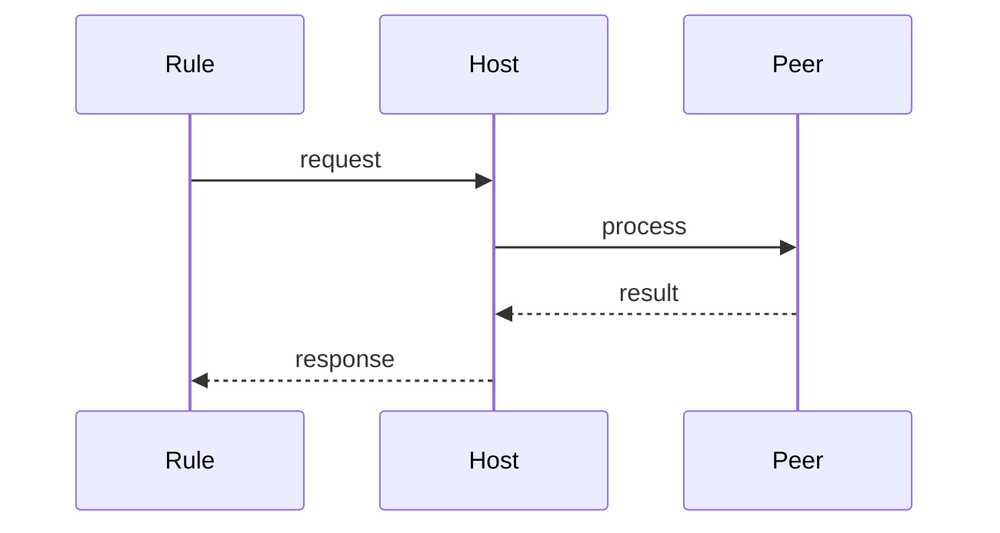

# Firewall

> Stub — expanded as the CLI evolves.

## Model

- Default: everything closed.
- Ports are opened by allow-list, scoped by CIDR.
- Peers between nodes are declared explicitly.

## Notes

- Hardening disables root login and uses a dedicated user.
- Peer routing prefers the declared internal network.

## Flow

