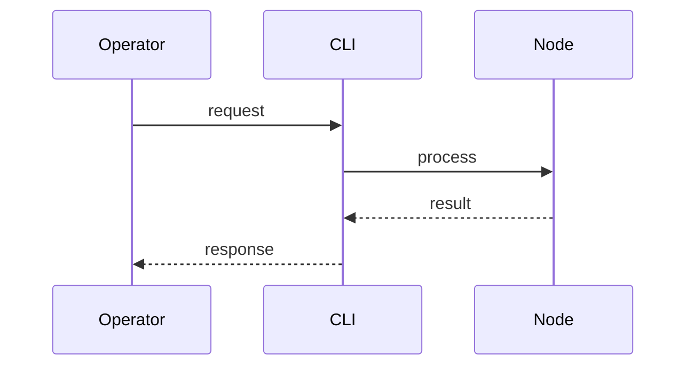

# Provisioning

> Stub — expanded as the CLI evolves.

## Model

- One YAML describes nodes (`host`, role, tags) and services.
- `init` sets up a node; `join` adds it to a cluster.
- Provisioning is idempotent.

## Profiles

Services declare a resource profile (cpu/memory). Pick the smallest that fits.

## Notes

- Services not declared are removed on the next run.

## Flow

